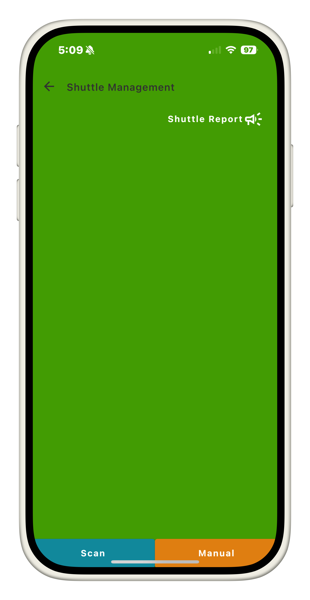
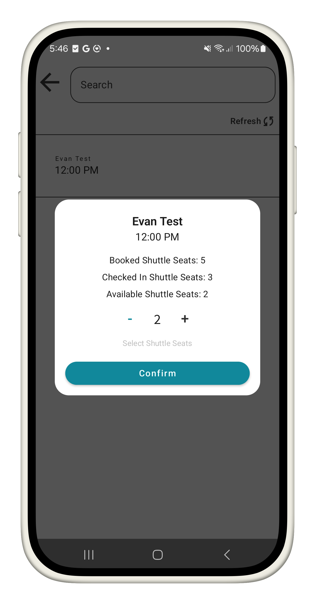
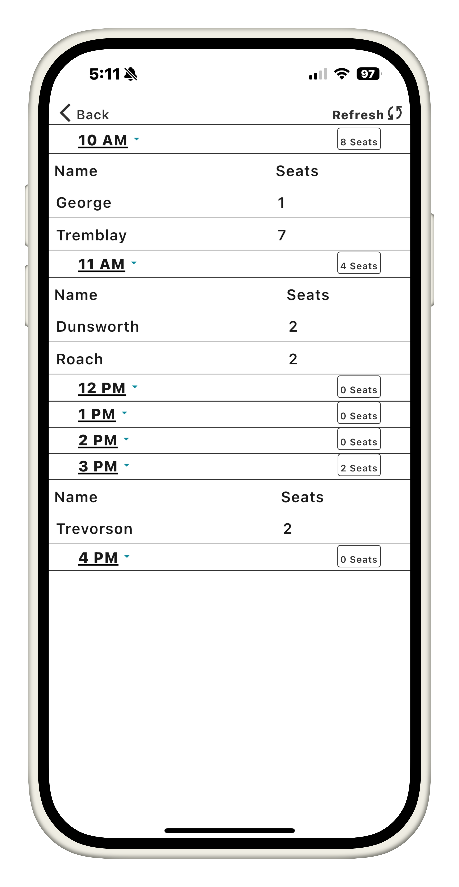

# Shuttle Management
This module provides a streamlined interface to quickly access essential booking details specifically related to shuttle seats.

## Purpose
Shuttle seat information is excluded from rental details elsewhere in the application, as it is not relevant to the standard check-in/check-out process. The shuttle management module is designed to focus exclusively on shuttle seat details.

## Locating Records
Booking records can be retrieved using the same methods available in the Check-In mode:
1. QR Code
2. Manual Search

### QR Code
QR code lookup is available when the customer provides their FareHarbor-associated QR code. This will only pull from bookings that are valid for current date.

### Manual Search
Manual search displays booking records for the current date that **include at least one active shuttle seat**. Records can be searched by the organizer's name.

## Reading Records
Only essential bare bones information is provided about the booking including:
1. Name of organizer
2. Booking Date & Time
3. Number of shuttle seats associated with booking

## Shuttle Checkin
When viewing a shuttle record through either QR or Manual Lookup, Users with the `shuttle.checkin` permission are able to manage the number of shuttle seats to check in per booking. Users cannot check in more shuttle seats than are defined, and cannot reduce checked in seats once confirmed. 

## Shuttle Report
Within the shuttle management module, there is also a Report view. This page will display all bookings for the current day with at least one shuttle seat associated with the account. This report displays these bookings per whole hour based on their Booking Date & Time

The shuttle report displays the following booking information:
1. Whole hour of the booking
2. Last name of organizer
3. Number of shuttle seats associated with the booking
4. Number of shuttle seats associated with the whole hour

> Each hour within the report page can also be collapsed to refine only important information

